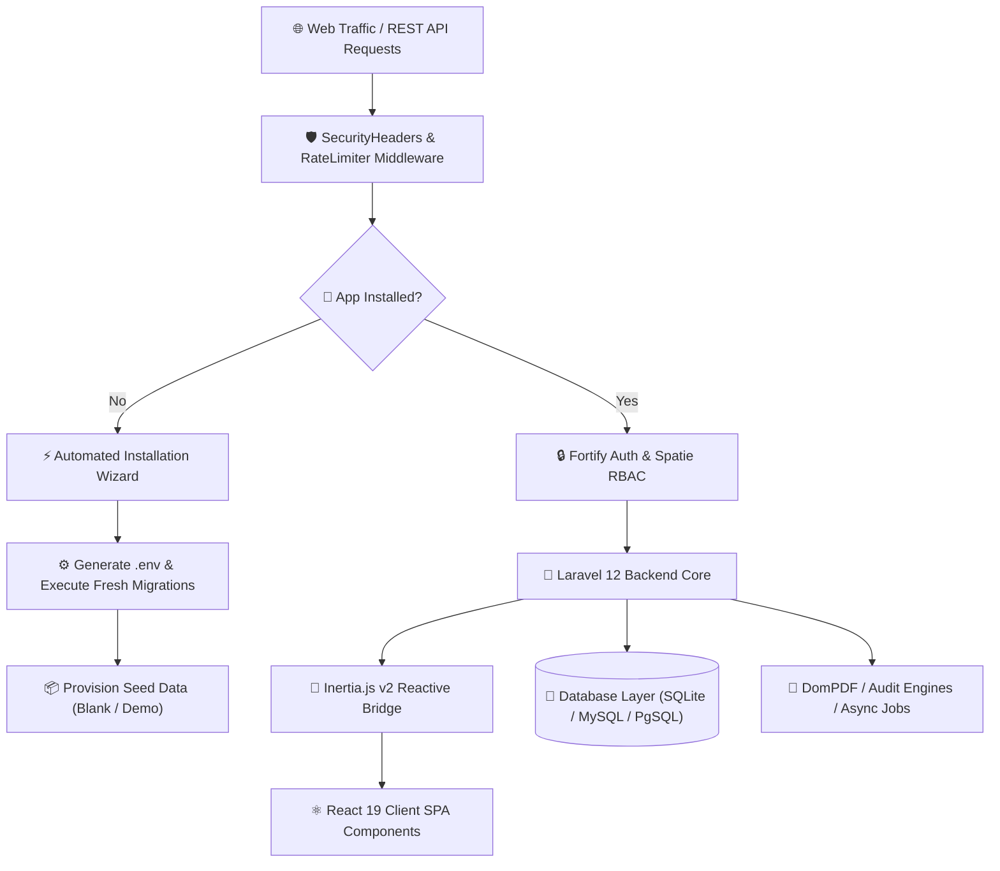

<div align="center">

<br />

# 🌌 S P A C E R E A C H

### *Next-Generation Enterprise Revenue OS, AI Lead Prospecting Engine & HR Platform*

<br />

[](https://laravel.com)
[](https://react.dev)
[](https://inertiajs.com)
[](https://tailwindcss.com)
[](https://php.net)

<br />

[](#-enterprise-security-hardening)
[](#-automated-installation-wizard)
[](https://github.com/thespacecode/SpaceReach/actions)
[](#-license)

<br />

[✨ Key Features](#-key-feature-modules) • [🏛️ System Architecture](#%EF%B8%8F-system-architecture--technical-insights) • [⚡ Automated Setup](#-automated-installation-wizard) • [🛡️ Security Hardening](#-enterprise-security-hardening) • [🚀 Quickstart](#-quickstart--installation)

---

</div>

<br />

## 🌟 Executive Overview

**SpaceReach** is an ultra-premium, enterprise-grade revenue acceleration platform designed to unify lead acquisition, customer relationship management, workforce operations, financial intelligence, and autonomous AI customer support into a single, high-performance interface.

Engineered on a modern monolith paradigm using **Laravel 12**, **React 19**, **Inertia.js v2**, and **Tailwind CSS v4**, SpaceReach eliminates traditional API overhead by seamlessly bridging server-side routing with client-side reactive component rendering.

> [!TIP]
> **Zero-Configuration Setup**: SpaceReach includes an automated installation engine (`/install` & `./install.sh`) that self-diagnoses server requirements, tests database connectivity, and provisions a production-ready **Blank Application** or a full **Demo Dataset** in seconds.

<br />

---

## 🏛️ System Architecture & Technical Insights



<br />

<details>
<summary><b>🔍 Click to view Deep Technical Architectural Insights</b></summary>

<br />

### 1. **Inertia.js v2 Reactive Monolith**
- Replaces legacy REST/GraphQL boilerplate by routing directly from Laravel controllers to React components.
- Maintains client-side Single Page Application (SPA) speed with zero page refreshes and preserved client state.

### 2. **Installation Guard & Defense-in-Depth**
- `CheckInstallationMiddleware` automatically intercepts uninstalled requests and routes to the installer setup wizard (`/install`).
- Once installed, installer routes are locked (`403 Forbidden`) at both middleware and controller levels to prevent unauthorized environment re-initialization.

### 3. **Modular Seeding Architecture**
- **`CoreSeeder`**: Seeds system defaults (RBAC permissions, roles, portal brand tokens, default pipelines, leave types, chatbot categories) + Super Admin account.
- **`DemoSeeder`**: Populates full demonstration dataset (500 contacts, 500 deals, 500 invoices/payments, audit logs, and lead engine records).

### 4. **Hardened HTTP Response Pipeline**
- Injects `SAMEORIGIN`, `nosniff`, HSTS, Referrer-Policy, and Content-Security-Policy headers into every HTTP response.
- Protects public API endpoints, webhooks, and form submissions with IP-based rate limiters (`throttle`).

</details>

<br />

---

## ✨ Key Feature Modules

<br />

### 🎯 1. Lead Prospecting & Acquisition Engine
- **Master Lead Sheets**: High-density data grid to filter, bulk-action, import, export, and manage prospective leads.
- **Tech Stack & Domain Detector**: Scrapes company domain footprints, tech stacks, and qualification scores.
- **Deduplication Engine**: Prevents redundant lead imports and auto-scores prospects based on Ideal Customer Profiles (ICP).

### 💼 2. Opportunity & Deal Pipeline (CRM)
- **Interactive Kanban Pipeline**: Drag-and-drop opportunity deals across custom sales stages with win-probability metrics.
- **360° Contact Profiles**: Activity timelines, interaction histories, associated quotes, and internal notes.
- **Commercial Proposals**: Instant PDF quote generation powered by `barryvdh/laravel-dompdf`.

### 👥 3. HR Operations & Workforce Suite
- **Org Directory & Hierarchy**: Department structures, designation levels, and manager reporting lines.
- **Leave Request Management**: Flexible leave submissions, paid/unpaid quota tracking, and manager approval workflows.
- **OKRs & Performance Reviews**: Company/department goal alignment, key results tracking, and multi-rater peer reviews.

### 💰 4. Revenue Intelligence & Finance
- **Branded Invoicing**: Generate itemized PDF invoices with automatic tax calculations and aging balances.
- **Payment Distribution Tracking**: Record incoming transactions, monitor outstanding dues, and view cash flow velocity.
- **Executive Analytics**: Real-time KPI summary cards, sparklines, and financial performance dashboards built with Recharts.

### 🤖 5. Autonomous AI Chatbot Suite
- **Embeddable Web Widget**: Customizable chat widget matching your portal styling.
- **Intent Knowledge Base**: Category mapping, synonym resolution, and intelligent fallback triggers.
- **Unanswered Query Logger**: Auto-captures unrecognized visitor questions for continuous knowledge base expansion.

<br />

---

## 🛡️ Enterprise Security Hardening

SpaceReach is hardened out of the box against OWASP Top 10 vulnerabilities:

| Security Vector | Implementation Mechanism |
| :--- | :--- |
| **HTTP Security Headers** | `X-Frame-Options: SAMEORIGIN`, `X-Content-Type-Options: nosniff`, `X-XSS-Protection`, `Referrer-Policy`, HSTS, CSP |
| **Endpoint Rate Limiting** | Strict `throttle` middleware protecting installer, chatbot API, and lead ingestion webhooks |
| **Installer Lockdown** | `ensureNotInstalled()` guard returning `403 Forbidden` on initialized environments |
| **Server & File Protection** | `.htaccess` rules denying access to `.env`, `.git`, `.sqlite`, `.log`, and configuration files |
| **Environment Hardening** | Sanitized multiline `.env` writer with strict `chmod 0600` permissions |
| **Session Security** | `http_only = true`, `same_site = 'lax'`, JSON serialization |
| **RBAC & Audit Trail** | Granular permissions via `spatie/laravel-permission` and immutable `AuditLog` logging |

<br />

---

## ⚡ Automated Installation Wizard

Deploy SpaceReach seamlessly on any web server in **under 60 seconds**:

```
 🚀 SpaceReach Installation Pipeline
 ├── 1. System Requirements & Permissions Check (PHP 8.2+, Extensions, Storage Permissions)
 ├── 2. Environment Setup (App Name, App URL, Environment, Debug Mode)
 ├── 3. Database Connection & Real-Time Test (MySQL, PostgreSQL, SQLite)
 ├── 4. Application Mode Selection (Blank Application vs Demo Dataset)
 └── 5. Super Admin Account Creation
```

### Option 1: Web Installer (Browser)
1. Upload or clone repository to your server path.
2. Visit your domain URL in any browser (e.g. `http://your-server-domain.com`).
3. Follow the interactive 5-step **SpaceReach Web Installation Wizard**.

### Option 2: CLI Terminal Script
Run the automated deployment script directly from your shell:
```bash
./install.sh
```
Or execute the Artisan installer command:
```bash
php artisan app:install
```

<br />

---

## 🛠️ Technology Stack & Dependencies

| Layer | Technology |
| :--- | :--- |
| **Backend Core** | Laravel 12.x (PHP 8.2+) |
| **Frontend Architecture** | React 19 + Inertia.js v2 SPA Bridge |
| **Styling & Design System** | Tailwind CSS v4 + Radix UI Primitives |
| **Icon System** | Lucide React |
| **Data Visualization** | Recharts |
| **Build Engine** | Vite 6 |
| **Database Engine** | MySQL / PostgreSQL / SQLite |
| **PDF Processing** | DomPDF (`barryvdh/laravel-dompdf`) |
| **Authentication & RBAC** | Laravel Fortify + Spatie Laravel Permission |

<br />

---

## 🚀 Quickstart & Local Setup

### System Prerequisites
- **PHP** `>= 8.2` (Extensions: `pdo`, `mbstring`, `openssl`, `tokenizer`, `xml`, `ctype`, `json`, `fileinfo`, `bcmath`)
- **Composer** `>= 2.x`
- **Node.js** `>= 20.x` & `npm`

### Installation Steps

```bash
# 1. Clone the repository
git clone git@github.com:thespacecode/SpaceReach.git SpaceReach
cd SpaceReach

# 2. Execute automated setup script
./install.sh

# 3. Start local development server
php artisan dev

# 4. In a second terminal, start Vite HMR
npm run dev
```

Open `http://localhost:8000` in your web browser to log in.

<br />

---

## 🧪 Quality Assurance & CI/CD

SpaceReach maintains a 100% passing automated testing suite powered by **GitHub Actions** (`.github/workflows/ci.yml`).

```bash
# Run PHP Feature & Unit Test Suite
php artisan test

# Execute PHP Syntax Linting
find app config database routes tests -name "*.php" -exec php -l {} \;

# Build Production Frontend Assets
npm run build
```

<br />

---

## 📄 License & Attribution

Designed, developed, and maintained by **[The Space Code](https://thespacecode.com)**. All rights reserved.

<br />

<div align="center">

---

Built with ❤️ by **[thespacecode.com](https://thespacecode.com)**

</div>
