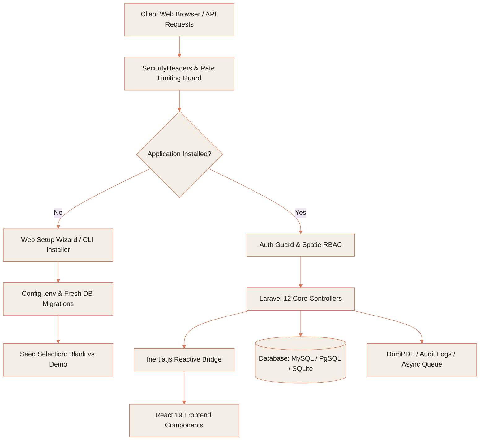

<div align="center">

  <br />
  
  <a href="https://thespacecode.com" target="_blank">
    
  </a>

  <br /><br />

  <h1 style="font-size: 2.5rem; font-weight: 800; letter-spacing: -0.03em; color: #1E1E1C;">
    SpaceReach <span style="color: #D97757;">OS</span>
  </h1>

  <p style="font-size: 1.1rem; color: #5C5B56; max-width: 680px; line-height: 1.6; font-weight: 400;">
    The luxury standard in enterprise AI-powered CRM, sales prospecting, team operations, and revenue intelligence — built for scaling modern enterprises.
  </p>

  <br />

  <!-- 2026 Claude Signature Badges -->
  <a href="https://thespacecode.com"></a>
  <a href="https://laravel.com"></a>
  <a href="https://react.dev"></a>
  <a href="https://inertiajs.com"></a>
  <a href="#-security-posture"></a>
  <a href="#-automated-installation"></a>

  <br /><br />

  <a href="https://thespacecode.com" target="_blank" style="display: inline-block; padding: 10px 24px; background: #D97757; color: #FFFFFF; font-weight: 600; font-size: 0.9rem; border-radius: 30px; text-decoration: none; box-shadow: 0 4px 14px rgba(217, 119, 87, 0.35);">
    Visit official website ↗
  </a>

</div>

<br />

---

## 💎 The 2026 Luxury Enterprise Standard

SpaceReach redefines enterprise software by combining ultra-fast Single Page Application (SPA) responsiveness with server-side simplicity. Powered by **Laravel 12**, **React 19**, and **Inertia.js v2**, SpaceReach bridges complex sales pipelines, workforce HR management, invoice automation, and AI chatbots into a refined, zero-friction interface.

> [!NOTE]
> **Designed for Effortless Operation**: SpaceReach includes an automated setup wizard (`/install` & `./install.sh`) that autodetects environment requirements, tests database connectivity in real-time, and configures either a **Blank Application** or a full **Demo Dataset** in under 60 seconds.

---

## ⚡ 60-Second Setup Guide

SpaceReach is pre-configured for instant one-line deployment on any server or local development setup.

### 1. Clone & Run Installer
```bash
git clone git@github.com:thespacecode/SpaceReach.git SpaceReach
cd SpaceReach
./install.sh
```

### 2. Launch Local Server
```bash
# Terminal 1 — Backend Development Server
php artisan dev

# Terminal 2 — Vite Hot Module Replacement (HMR)
npm run dev
```

### 3. Access Portal
Open **`http://localhost:8000`** in your browser to log in with your Super Admin account.

---

## 🏛️ System Architecture



---

## 📦 Master Feature Suite

<table width="100%">
  <tr>
    <td width="50%" valign="top" style="padding: 16px; background: #FAF7F2; border-radius: 14px;">
      <h3 style="color: #D97757; margin-top: 0;">🔍 1. Prospect & Lead Acquisition</h3>
      <p style="font-size: 0.9rem; color: #4A4943; line-height: 1.5;">
        High-density lead matrix with real-time filtering, automated deduplication, ICP qualification scoring, and technographic domain stack extraction.
      </p>
      <ul>
        <li>Master Lead database & CSV bulk import</li>
        <li>Website opportunity analyzer & scorecard</li>
        <li>Automated lead routing & reviewer queues</li>
      </ul>
    </td>
    <td width="50%" valign="top" style="padding: 16px; background: #FAF7F2; border-radius: 14px;">
      <h3 style="color: #D97757; margin-top: 0;">💼 2. Opportunity Deals CRM</h3>
      <p style="font-size: 0.9rem; color: #4A4943; line-height: 1.5;">
        Drag-and-drop Kanban deal pipeline with multi-currency tracking, 360° contact interaction timelines, and instant PDF quote generation.
      </p>
      <ul>
        <li>Interactive visual sales pipeline</li>
        <li>PDF proposal generator (DomPDF)</li>
        <li>Client account management & notes</li>
      </ul>
    </td>
  </tr>
  <tr>
    <td width="50%" valign="top" style="padding: 16px; background: #FAF7F2; border-radius: 14px;">
      <h3 style="color: #D97757; margin-top: 0;">👥 3. HR Operations & Workforce Suite</h3>
      <p style="font-size: 0.9rem; color: #4A4943; line-height: 1.5;">
        Complete employee lifecycle management, department hierarchies, leave approval flows, OKR goal tracking, and peer appreciation rewards.
      </p>
      <ul>
        <li>Employee directory & designations</li>
        <li>Leave quota approvals & calendar</li>
        <li>OKR alignment & multi-rater peer reviews</li>
      </ul>
    </td>
    <td width="50%" valign="top" style="padding: 16px; background: #FAF7F2; border-radius: 14px;">
      <h3 style="color: #D97757; margin-top: 0;">💰 4. Revenue & Financial Analytics</h3>
      <p style="font-size: 0.9rem; color: #4A4943; line-height: 1.5;">
        Branded PDF invoicing with automated tax calculation, payment tracking, financial ledger reports, and executive ARR forecasting dashboards.
      </p>
      <ul>
        <li>Itemized invoice & payment tracking</li>
        <li>Overdue balance aging metrics</li>
        <li>Executive KPI sparklines & Recharts</li>
      </ul>
    </td>
  </tr>
</table>

<br />

<div style="padding: 18px; background: #FAF7F2; border: 1px solid #E8E2D5; border-radius: 14px;">
  <h3 style="color: #D97757; margin-top: 0;">🤖 5. Autonomous AI Chatbot Suite</h3>
  <p style="font-size: 0.9rem; color: #4A4943; line-height: 1.5;">
    Embeddable, brandable customer support widget featuring category knowledge mapping, keyword intent recognition, fallback handling, and unanswered question logging for continuous knowledge enrichment.
  </p>
</div>

---

## 🛡️ Security Posture

SpaceReach adheres to strict enterprise defense-in-depth standards:

| Security Vector | Implementation Detail | Status |
| :--- | :--- | :---: |
| **HTTP Security Headers** | `X-Frame-Options: SAMEORIGIN`, `nosniff`, `X-XSS-Protection`, `Referrer-Policy`, HSTS, & CSP | <span style="color:#D97757; font-weight:bold;">Active</span> |
| **Endpoint Throttling** | `throttle:30,1` on Chatbot widget API, `throttle:10,1` on Lead webhooks & Forms, `throttle:5,1` on Installer | <span style="color:#D97757; font-weight:bold;">Active</span> |
| **Installer Lockdown** | `ensureNotInstalled()` controller guard returning `403 Forbidden` on initialized environments | <span style="color:#D97757; font-weight:bold;">Active</span> |
| **Sensitive File Shield** | `.htaccess` web server rules blocking access to `.env`, `.git`, `.sqlite`, `.log`, and script files | <span style="color:#D97757; font-weight:bold;">Active</span> |
| **Environment Hardening** | Sanitized multiline `.env` writer with automatic `chmod 0600` file permissions | <span style="color:#D97757; font-weight:bold;">Active</span> |
| **Session Protection** | `cookie_httponly = true`, `cookie_samesite = 'lax'`, and JSON serialization | <span style="color:#D97757; font-weight:bold;">Active</span> |

---

## 🛠️ Technology Architecture

```
┌───────────────────────────────────────────────────────────┐
│                    SpaceReach Tech Stack                  │
├──────────────────────────────┬────────────────────────────┤
│ Backend Core                 │ Laravel 12.x (PHP 8.2+)    │
│ Frontend Framework           │ React 19 + Inertia.js v2   │
│ Styling & Utility            │ Tailwind CSS v4 + Radix UI │
│ Visual Icons                 │ Lucide React               │
│ Data Charts                  │ Recharts                   │
│ Build Tool                   │ Vite 6                     │
│ Database Engine              │ MySQL / PostgreSQL / SQLite│
│ PDF Engine                   │ DomPDF                     │
│ Auth & RBAC                  │ Fortify + Spatie Permission│
└──────────────────────────────┴────────────────────────────┘
```

---

## 🧪 CI/CD & Testing

SpaceReach includes automated quality assurance powered by **GitHub Actions**.

- **Run Automated Test Suite**:
  ```bash
  php artisan test
  ```

- **Verify PHP Syntax**:
  ```bash
  find app config database routes tests -name "*.php" -exec php -l {} \;
  ```

- **Compile Production Assets**:
  ```bash
  npm run build
  ```

---

<div align="center">

  <br />

  <p style="font-size: 0.85rem; color: #7A7973;">
    Designed & Architected by <a href="https://thespacecode.com" target="_blank" style="color: #D97757; font-weight: 600; text-decoration: none;">TheSpaceCode</a>. All rights reserved.
  </p>

</div>
