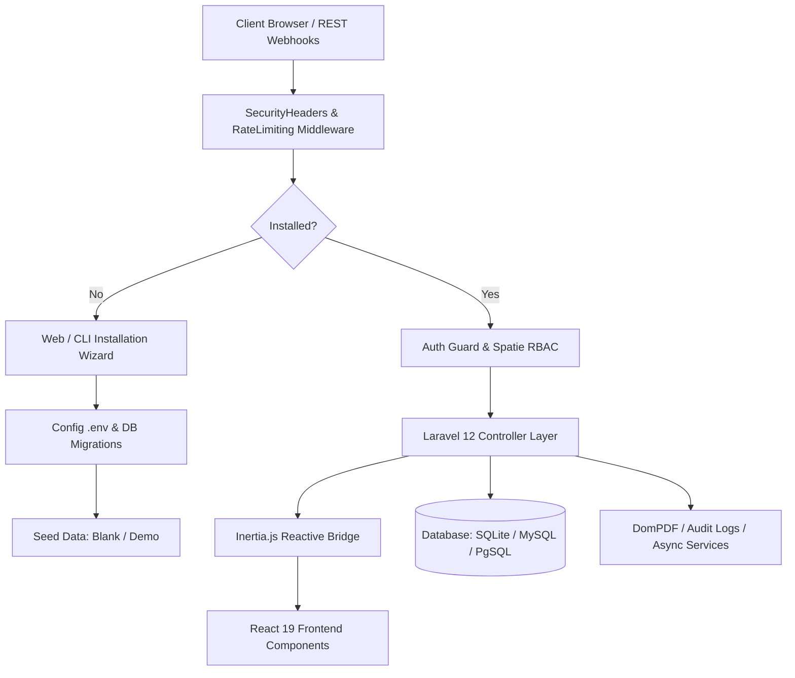

<div align="center">

# 🚀 SpaceReach Portal

### *Next-Gen Enterprise AI-Powered CRM, Lead Prospecting Engine, HR Suite & Financial Platform*

[](https://php.net)
[](https://laravel.com)
[](https://react.dev)
[](https://inertiajs.com)
[](https://tailwindcss.com)
[](#-enterprise-security-hardening)
[](#-automated-portal-installation-system)
[](https://github.com/thespacecode/SpaceReach/actions)

<br />

**[Key Features](#-key-feature-modules)** • **[System Architecture](#-system-architecture--technical-insights)** • **[Automated Setup](#-automated-portal-installation-system)** • **[Security Hardening](#-enterprise-security-hardening)** • **[Quickstart](#-quickstart--installation)**

</div>

---

## 🌟 Overview & Strategic Vision

**SpaceReach** is an enterprise-grade, all-in-one revenue acceleration, customer relationship, human resource, and financial intelligence suite. Engineered for high-velocity teams, SpaceReach unifies real-time lead prospecting, deal pipeline tracking, workforce operations, automated invoicing, and AI-driven customer engagement into a single, cohesive portal.

Designed with **Laravel 12**, **React 19**, **Inertia.js v2**, and **Tailwind CSS v4**, SpaceReach delivers a fluid Single Page Application (SPA) experience with zero API overhead, powered by server-side routing and client-side reactive rendering.

> [!TIP]
> **Zero-Configuration Deployment**: SpaceReach includes a built-in automated installation wizard (`/install` & `./install.sh`) that self-detects database parameters, checks system requirements, and provisions either a clean **Blank Application** or a full **Demo Dataset** in seconds.

---

## 📐 System Architecture & Technical Insights

SpaceReach is architected around a multi-tier modular pattern prioritizing enterprise security, high throughput, and developer experience.



### 🧠 Deep Architecture Insights

1. **Inertia.js Single-Page Architecture**:
   - Eliminates client-side routing complexity and REST API glue code. Controllers render Inertia views directly while preserving SPA state transitions and zero-refresh page loads.

2. **Automated Setup Guard & Lock Engine**:
   - `CheckInstallationMiddleware` enforces automatic redirection to `/install` if the application is not initialized.
   - Once installed, the setup wizard enters a locked state (`403 Forbidden`) guarded at both controller and middleware layers to prevent unauthorized re-installation attempts.

3. **Multi-Tenant Data Seeding System**:
   - **`CoreSeeder`**: Seeds system defaults (RBAC permissions, roles, portal colors, default deal pipelines, default leave types, chatbot categories) + Super Admin account.
   - **`DemoSeeder`**: Inherits `CoreSeeder` and populates 500+ contacts, 500 deals, 500 invoices/payments, audit logs, and lead engine records for rapid product evaluation.

4. **Defense-in-Depth Security Filter**:
   - Automatic HTTP Security Headers injection (`SAMEORIGIN`, `nosniff`, `strict-origin-when-cross-origin`, HSTS, CSP).
   - Strict rate-limiting (`throttle:5,1` on installer, `throttle:30,1` on Chatbot widget API, `throttle:10,1` on Lead webhooks).
   - `.htaccess` directives preventing unauthorized access to `.env`, `.sqlite`, `.log`, and `.git` files.

---

## 🎯 Key Feature Modules

### 1. 🔍 Prospect & Lead Acquisition Engine
- **Master Lead Sheet**: High-density data grid to filter, bulk-action, import, export, and manage leads in real-time.
- **Deduplication & Qualification Engine**: Automatically flags duplicate contacts and scores prospective leads based on customized Ideal Customer Profiles (ICP).
- **Domain & Tech Detector**: Analyzes domain footprints, technographic stacks, and qualification indexes for outreach personalization.

### 2. 💼 Opportunity & Deal Pipeline (CRM)
- **Interactive Kanban Pipeline**: Drag-and-drop deals across customized sales pipeline stages with probability forecasting.
- **360° Contact Profiles**: Timeline view of activities, communication logs, notes, quotes, and deal associations.
- **Commercial Quotes & Proposals**: Instant PDF proposal generation powered by `barryvdh/laravel-dompdf`.

### 3. 👥 HR Operations & Workforce Suite
- **Org Chart & Directory**: Department hierarchy, designation levels, and reporting structures.
- **Leave Approval Workflows**: Flexible leave request submissions, paid/unpaid quota tracking, and manager approval queues.
- **OKRs & Key Results**: Goal alignment across company, department, and individual performance tiers.
- **Multi-Rater Peer Reviews**: Structured performance feedback workflows and recognition rewards.

### 4. 💰 Revenue Intelligence & Invoicing
- **PDF Invoice Engine**: Branded invoice creation with itemized line items, automated tax calculation, and payment status tracking.
- **Payment Distribution Tracking**: Monitor incoming transactions, overdue aging metrics, and revenue velocity.
- **Executive Analytics**: Real-time KPI cards, sparklines, and revenue forecasting charts built with Recharts.

### 5. 🤖 Autonomous AI Chatbot System
- **Embeddable Web Widget**: Lightweight, responsive chatbot widget with custom brand styling.
- **Knowledge Base & Intent Engine**: Automated category mapping, keyword matching, and response fallback rules.
- **Unanswered Query Logger**: Auto-captures unrecognized visitor questions for continuous AI knowledge expansion.

---

## 🔐 Enterprise Security Hardening

SpaceReach implements an enterprise security posture out of the box:

| Security Layer | Implementation Detail |
| :--- | :--- |
| **HTTP Security Headers** | `X-Frame-Options: SAMEORIGIN`, `X-Content-Type-Options: nosniff`, `X-XSS-Protection`, `Referrer-Policy`, HSTS, and CSP |
| **API & Webhook Throttling** | Strict rate limiters (`throttle`) protecting public endpoints against DoS and brute-force attacks |
| **Installer Lockdown** | `ensureNotInstalled()` guard returning `403 Forbidden` on initialized environments |
| **File Access Rules** | `.htaccess` web server rules blocking access to `.env`, `.git`, `.sqlite`, `.log`, and script files |
| **Environment Protection** | Sanitized multiline `.env` generator with automatic `chmod 0600` file permissions |
| **Session Security** | `cookie_httponly = true`, `cookie_samesite = 'lax'`, JSON serialization |
| **RBAC & Audit Trail** | Fine-grained permissions via `spatie/laravel-permission` and immutable `AuditLog` records |

---

## ⚡ Automated Portal Installation System

SpaceReach can be deployed effortlessly via **Web Installer** or **CLI Command**:

```
 🚀 SpaceReach Portal Setup Wizard
 ├── 1. System Requirements & Permissions Check (PHP 8.2+, Extensions, Storage Permissions)
 ├── 2. Environment Setup (App Name, URL, Environment, Debug mode)
 ├── 3. Database Connection & Real-Time Test (MySQL, PostgreSQL, SQLite)
 ├── 4. Application Data Choice (Blank Application vs Demo Dataset)
 └── 5. Super Admin Account Creation
```

### Option A: Web Setup Wizard
1. Clone repository to your web server address.
2. Visit the domain in your web browser (e.g. `http://your-server-domain.com`).
3. You will be automatically greeted by the interactive 5-step **SpaceReach Installation Wizard**.

### Option B: CLI One-Line Installer
Run the automated deployment script directly from your terminal:
```bash
./install.sh
```
Or run the Artisan installer command:
```bash
php artisan app:install
```

---

## 🛠️ Technology Stack

```
   ┌──────────────────────────────────────────────────────────┐
   │                    SpaceReach Stack                      │
   ├─────────────────────────────┬────────────────────────────┤
   │ Backend Framework           │ Laravel 12.x (PHP 8.2+)    │
   │ Frontend Framework          │ React 19 + Inertia.js v2   │
   │ Styling & UI Design         │ Tailwind CSS v4 + Radix UI │
   │ Icons & Visual System       │ Lucide React               │
   │ Data Visualization          │ Recharts                   │
   │ Build Engine                │ Vite 6                     │
   │ Database Engine             │ MySQL / PostgreSQL / SQLite│
   │ PDF Generation              │ DomPDF                     │
   │ Security & RBAC             │ Fortify + Spatie Permission│
   └─────────────────────────────┴────────────────────────────┘
```

---

## 🚀 Quickstart & Local Development

### Prerequisites
- **PHP** `>= 8.2` (Extensions: `pdo`, `mbstring`, `openssl`, `tokenizer`, `xml`, `ctype`, `json`, `fileinfo`, `bcmath`)
- **Composer** `>= 2.x`
- **Node.js** `>= 20.x` & `npm`

### Manual Development Setup

1. **Clone the Repository**
   ```bash
   git clone git@github.com:thespacecode/SpaceReach.git SpaceReach
   cd SpaceReach
   ```

2. **Run Automated Setup Script**
   ```bash
   ./install.sh
   ```

3. **Start Development Servers**
   ```bash
   # Terminal 1: Laravel Backend Server
   php artisan dev

   # Terminal 2: Vite Hot Module Replacement (HMR)
   npm run dev
   ```

4. **Access Portal**: Open `http://localhost:8000` in your web browser.

---

## 🧪 Testing & CI/CD Pipeline

SpaceReach includes automated quality checks and continuous integration powered by **GitHub Actions**.

- **Execute PHP Unit & Feature Tests**:
  ```bash
  php artisan test
  ```

- **Run PHP Syntax Verification**:
  ```bash
  find app config database routes tests -name "*.php" -exec php -l {} \;
  ```

- **Compile Production Assets**:
  ```bash
  npm run build
  ```

---

## 📜 License

SpaceReach is proprietary software designed, built, and maintained by **[The Space Code](https://thespacecode.com)**. All rights reserved.
